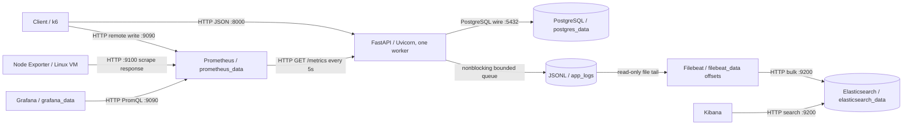

# Campus Room Booking Service — Observability Lab

A small, concurrent room-reservation API with a complete local metrics and logging stack. Students can inspect three campus rooms, check availability, create a reservation, and cancel it. Swagger is the UI. The engineering focus is correctness under contention, measurable performance, diagnosable failures, and repeatable experiments.

**Verification status:** see [docs/VERIFICATION.md](docs/VERIFICATION.md) for actual Docker Desktop results, saved evidence, and included screenshot evidence. Native Windows measurements from the earlier implementation are kept separately and are not presented as Docker measurements.

**Human-readable submission files:** the project root contains README.pdf, REPORT.pdf, ASSIGNMENT-CHECKLIST.pdf, VIVA-NOTES.pdf, VERIFICATION.pdf and SCREENSHOT-CHECKLIST.pdf. The identical screenshot instructions are also in SCREENSHOT-CHECKLIST.txt. Read these PDFs; no manual Markdown conversion is required. The 15 original user-captured PNGs are preserved in screenshots/ and included in REPORT.pdf.

The read-only submission page at http://localhost:8011 shows actual saved services/test/concurrency evidence and prepared screenshot links. If a future restart closes this optional viewer, run `python scripts/submission-viewer.py` from the root. It serves only public submission files, never `.env` or arbitrary project files.

After screenshots exist, `python scripts/build-submission-pdfs.py` inserts the original PNGs from screenshots/ (with root fallback) into REPORT.pdf and regenerates all six PDFs. `python scripts/validate-submission-pdfs.py` reopens and renders every page for visual review. Optional host dependencies are in `requirements-pdf.txt`; these are separate from application dependencies. The current PDFs are already generated and validated for you.

## Architecture



PostgreSQL is the only runtime service required for booking operations. Observability services can fail independently. See the [failure matrix and data journeys](report.md#part-d--system-design).

## Prerequisites and quick start (PowerShell)

Use Docker Desktop with Linux containers and Compose v2 (`docker compose version`). Reserve roughly 6–8 GB of Docker memory and at least 10 GB of free disk. Container memory ceilings total approximately 4.7 GB before Docker overhead, builds, and optional tests. These are configured budgets, not measured consumption. No cloud accounts are needed. Python on the host is optional; the app image uses Python 3.12.10.

From the repository root:

```powershell
if (-not (Test-Path .env)) { Copy-Item .env.example .env }
docker compose config --quiet
docker compose up --build -d --wait --wait-timeout 300
docker compose ps -a
docker compose exec -T app python scripts/setup-kibana.py
powershell -ExecutionPolicy Bypass -File scripts/smoke.ps1
docker compose exec -T app python scripts/verify-stack.py
```

`elastic-setup` and `log-init` exiting successfully with code 0 is expected. `log-init` gives the shared log directory to the unprivileged app user regardless of volume creation order. The app creates schema version 1 and seeds three rooms transactionally. Repeated startup preserves bookings. Grafana dashboards and datasource load automatically. Kibana's idempotent setup command creates the `campus-logs-*` data view; no manual field recreation is needed. ILM and explicit Elasticsearch field mappings are installed automatically by `elastic-setup` before Filebeat starts.

Bash equivalents:

```bash
test -f .env || cp .env.example .env
docker compose config --quiet
docker compose up --build -d --wait --wait-timeout 300
docker compose exec -T app python scripts/setup-kibana.py
curl -fsS http://localhost:8000/ready
docker compose --profile load run --rm k6 run /scripts/smoke.js
docker compose exec -T app python scripts/verify-stack.py
```

Keep `.env` private. The provided passwords are explicit local examples. Set `APP_PORT` in `.env` if 8000 is occupied. Other exposed ports are configured directly in Compose. All published ports bind to loopback. PostgreSQL and Node Exporter are reachable only inside the Compose network.

`KIBANA_ENCRYPTION_KEY` must be at least 32 characters and remain stable across restarts. `.env.example` contains a local-only placeholder; the verified machine has a generated private value in ignored `.env`. Preserve that file to keep saved-object encryption stable, and never commit the private value.

## URLs

| Service | URL | Notes |
|---|---|---|
| Swagger / API | http://localhost:8000/docs | OpenAPI at `/openapi.json` |
| Liveness / readiness | http://localhost:8000/health / http://localhost:8000/ready | Readiness checks DB schema |
| Raw metrics | http://localhost:8000/metrics | Prometheus text exposition |
| Prometheus targets | http://localhost:9090/targets | `cardinality-demo` is intentionally DOWN until enabled |
| Application dashboard | http://localhost:3000/d/campus-app | Login from `.env`; default `admin` / `local-coursework-change-me` |
| Performance dashboard | http://localhost:3000/d/campus-load | VUs, throughput, tails, errors, resources |
| Linux VM dashboard | http://localhost:3000/d/campus-node | Machine `docker-desktop-linux-vm` |
| Kibana Discover | http://localhost:5601/app/discover | Select Campus request logs, last 15 minutes |
| Elasticsearch | http://localhost:9200 | Local unauthenticated endpoint |

## API usage and booking correctness

| Method | Route | Success / expected errors |
|---|---|---|
| GET | `/rooms` | 200, three deterministic rooms |
| GET | `/rooms/{room_id}/availability?start_time=...&end_time=...` | 200, 404, 422 |
| POST | `/bookings` | 201, 409 overlap, 404 unknown room, 422 invalid input |
| GET | `/bookings/{booking_id}` | 200 or 404 |
| GET | `/bookings?room_id=1&status=confirmed&limit=25&offset=0` | 200; limit 1–100, offset 0–10000 |
| DELETE | `/bookings/{booking_id}` | 200, idempotent cancellation; 404 missing |

Supply timezone-aware ISO 8601 timestamps. Storage and log timestamps are UTC. Bookings must start in the future, end within 365 days, and last at most 8 hours. Intervals are **half-open `[start,end)`**, so back-to-back bookings are allowed. Availability is a snapshot, not a promise to reserve.

PostgreSQL's `btree_gist` exclusion constraint rejects overlapping ranges for the same room while status is confirmed. This protects writes from **all connections**, including simultaneous API calls and direct SQL. A pre-insert availability check alone would race. The application maps SQLSTATE `23P01` to 409, and counts a creation only after commit. Cancellation retains the row but removes it from the constraint's active set. UUID booking lookup uses the primary key; room/time listing and active-ending queries have indexes. Bootstrap uses an advisory transaction lock; existing schema changes require a future migration, not `CREATE TABLE IF NOT EXISTS` pretending to migrate.

PowerShell example:

```powershell
$base = 'http://localhost:8000'
$start = [DateTime]::UtcNow.AddDays(1)
$body = @{room_id=1; start_time=$start.ToString('o'); end_time=$start.AddHours(1).ToString('o')} | ConvertTo-Json
$booking = Invoke-RestMethod -Method Post "$base/bookings" -ContentType 'application/json' -Headers @{'X-Request-ID'='viva-booking-001'} -Body $body
Invoke-RestMethod "$base/bookings/$($booking.id)"
Invoke-RestMethod -Method Delete "$base/bookings/$($booking.id)"
```

Bash POST example (substitute future UTC times):

```bash
curl -i -X POST http://localhost:8000/bookings \
  -H 'Content-Type: application/json' -H 'X-Request-ID: viva-booking-001' \
  -d '{"room_id":1,"start_time":"2026-10-01T10:00:00Z","end_time":"2026-10-01T11:00:00Z"}'
```

No names, email addresses, or booking purposes are collected. Safe incoming request IDs (1–64 ASCII letters/digits/dots/underscores/hyphens, starting alphanumeric) are reused; other values are replaced with UUIDs. IDs are returned in `X-Request-ID`, included in error responses and logs, and excluded from production metric labels. Do not put personal data in IDs.

## Metrics, Grafana, and performance

Three committed dashboard JSON files live in `observability/grafana/dashboards/`. Edit the readable [generator](scripts/generate-dashboards.py), run `python scripts/generate-dashboards.py`, then restart Grafana to force refresh if needed. Datasource UID is stable (`prometheus`). No paid dashboards or plugins are required.

With host Python available, `python scripts/verify-observability.py --output results/dashboard-check.json` checks the provisioned datasource, all 40 panels and all 46 PromQL expressions against the running stack. It reads Grafana credentials from `.env` without printing them. Run during k6 traffic for client-series data, or pass `--at <UTC timestamp>` for historical dashboard queries. Empty live k6 series after a run are expected because the runner sends stale markers. This verifies provisioning/query results; inspect visual rendering using [the exact screenshot ranges](docs/DEMO-CHECKLIST.md).

`python scripts/collect-run-metrics.py --start <UTC timestamp> --end <UTC timestamp> --output results/resource-window.json` preserves actual five-second Prometheus samples and their sample mean/maximum. It does not substitute server histogram estimates for k6 client percentiles.

All four required metric types are used. The [report's metrics table](report.md#part-b--metrics) gives code locations, recording behavior, PromQL, and interpretation for each metric. HTTP durations use `perf_counter`; in-flight gauges decrement in `finally`. Routes are templates, unknown routes become `unmatched`, and arbitrary methods become `OTHER`. `/health`, `/ready`, `/metrics`, and docs do not inflate business throughput. Counters reset at process restart; `rate()` handles resets.

Useful queries:

```promql
sum(rate(http_requests_total{job="campus-app"}[1m]))
sum(rate(http_requests_total{job="campus-app",status=~"2.."}[1m]))
sum(rate(http_requests_total{job="campus-app",status=~"5.."}[1m])) or vector(0)
histogram_quantile(0.95, sum by (le) (rate(http_request_duration_seconds_bucket[5m])))
histogram_quantile(0.99, sum by (le) (rate(http_request_duration_seconds_bucket[5m])))
sum by (operation) (rate(db_operation_duration_seconds_sum[5m]))
  / clamp_min(sum by (operation) (rate(db_operation_duration_seconds_count[5m])), 0.000001)
```

Python's Summary exposes sum and count, **not quantiles**. Use histogram buckets for p95/p99. A 5-minute quantile window smooths results and mixes experiment phases unless you allow it to clear. `active_bookings` is a DB count of confirmed reservations ending in the future, refreshed every 5 seconds. It includes future bookings; it is not room occupancy. Check its refresh health/age panel before trusting it.

Own exploration: **booking conflict percentage** distinguishes room contention from server failure. A high 409 fraction with low DB latency and zero 5xx can mean demand for a room, not infrastructure saturation. Invalid requests are excluded from its denominator.

## Logs, retention, and Kibana

Application records are JSON lines in stdout and `/var/log/campus/app.jsonl` on `app_logs`. A 4096-record bounded queue decouples request execution from file/stdout I/O. Queue overflow increments `logging_dropped_total`; sink errors increment `logging_sink_errors_total`. Logs contain request IDs, normalized routes, methods, status, durations, operations, and error class names. Bodies, query strings, authorization, exception strings, and stack locals are not logged.

Filebeat tails the shared named volume rather than Docker Desktop's internal log paths. `ndjson` parsing places fields at the document root; the timestamp processor converts `timestamp` to `@timestamp`. An explicit template makes status/duration numeric and correlation fields searchable. Filebeat offset state lives in `filebeat_data`; Elasticsearch indices in `elasticsearch_data`. Kibana's saved view lives in Elasticsearch. See [KQL examples](observability/kibana/queries.md).

Retention is deliberately different at each layer:

| Storage | Retention / persistence |
|---|---|
| App file logs | Up to 8 × 10 MiB files (current + 7 backups), **size-based**, not seven days. Rotation happens on a write. Named volume survives restart/recreation. |
| Docker stdout logs | 3 × 10 MB per container; replaced when that container is removed. |
| Filebeat | 2048-event memory queue; process restart loses the volatile queue, but unread/unacknowledged retained files can be reread from persistent offsets. At-least-once delivery may duplicate a record. |
| Elasticsearch | ILM rolls at 1 day or 1 GB per primary shard, deletes 7 days **after rollover** (roughly 7–8 days for daily rollover, not an exact event TTL). Empty write indices do not necessarily roll. |
| Prometheus | 7 days or 1 GB of blocks, whichever limit applies first; WAL/head add overhead. |
| PostgreSQL | Bookings retained until explicitly reset; cancellation does not delete history. |

Backend outages do not block requests. Filebeat reconnects with capped backoff and bounded buffering; it can lose logs if an outage outlasts file rotation. There are no custom infinite request retry loops. Log shipping is best effort, not an audit-grade delivery guarantee. ILM configuration and policy attachment are checked by `verify-stack.py`; **seven-day expiry cannot be claimed from a short run**.

## Node Exporter on Windows

The measured machine is explicitly **`docker-desktop-linux-vm`**, the Linux environment used by Docker Desktop. Root/proc/sys are read-only mounts with host PID access. This does **not** provide Windows-native host monitoring: CPU and memory describe the Linux VM, and disks/filesystems are viewed through its kernel and mounts. Network counters depend on Docker's exposed namespace and may describe the exporter container; inspect `device` labels. On native Linux rename the static `machine` label in `observability/prometheus/prometheus.yml` and dashboard title to the real host. Some Docker Desktop security configurations block root mounts or host PID access; treat missing collectors as unavailable, never as zero usage.

The verified host exposes a WSL2 Linux kernel and approximately 15.5 GiB of VM memory. Collectors are explicitly enabled for CPU, memory, filesystems, disk I/O, network, uname, load, time, and VM statistics. Bare-metal DMI/RAID/tape collectors are excluded because their kernel paths do not exist here. Windows-shared mounts can appear through the VM filesystem view; this is not Windows-native instrumentation. The VM also lacks `/run/udev/data`: Node Exporter reports one startup message that optional disk device properties are unavailable, while disk byte counters still work and the diskstats collector succeeds.

## Tests and load tests

Full unit + real PostgreSQL suite, on an isolated ephemeral database:

```powershell
docker compose --profile test run --build --rm tests
docker compose --profile test stop postgres-test
```

The integration fixture **refuses** a database whose name does not end in `_test`. It truncates only the disposable test database's bookings. Tests cover validation, readiness, correlation, errors, metric increments, timeouts, cancellation retries, adjacent times, direct SQL constraint enforcement, and 20 simultaneous requests with exactly 1 creation and 19 conflicts.

Optional host-only unit checks (Python 3.12 recommended; verification host also tested 3.13):

```powershell
py -3.12 -m venv .venv
.\.venv\Scripts\python.exe -m pip install -r requirements-dev.txt
.\.venv\Scripts\python.exe -m ruff check app tests scripts experiments
.\.venv\Scripts\python.exe -m ruff format --check app tests scripts experiments
.\.venv\Scripts\python.exe -m pytest -q
```

Without `TEST_DATABASE_URL`, PostgreSQL tests explicitly skip. A mocked repository test is never reported as proof of the database constraint. Linux uses `python3 -m venv .venv` and `.venv/bin/python`.

```powershell
docker compose --profile load run --rm k6 run /scripts/smoke.js
docker compose --profile load run --rm -e SUMMARY_FILE=/results/baseline.json k6 run -o experimental-prometheus-rw /scripts/baseline.js
docker compose --profile load run --rm -e SUMMARY_FILE=/results/concurrency.json k6 run /scripts/concurrency.js
docker compose --profile load run --rm -e SUMMARY_FILE=/results/load.json k6 run -o experimental-prometheus-rw /scripts/load.js
docker compose --profile load run --rm -e SUMMARY_FILE=/results/stress.json k6 run -o experimental-prometheus-rw /scripts/stress.js
```

These commands also work in Bash. Only load/stress intentionally increase demand. `load.js` ramps through 10, 25, 50, 100, 200 VUs with 2-minute plateaus. Each iteration lists rooms, checks availability, creates/fetches/cancels a reservation; some intentionally conflict or list bookings. Unique iteration slots prevent accidental intra-run collisions. Run **one load test at a time** on the demo database; competing runs/manual future reservations can legitimately conflict. A cancelled reservation remains for history. Normal runs label deliberate 409s as expected; all other unexpected statuses affect thresholds. Tags omit URL and request IDs. Results are written to ignored `results/`; use different filenames to preserve runs. On native Linux ensure this directory is writable by the k6 container user.

Client duration includes transport; server duration includes the fault, pool wait, and handler. Report k6 request rate, p95, p99, unexpected response fraction, VUs, phase times, resource allocation, and whether thresholds passed. Server dashboards exclude setup `/ready` requests, whereas k6's overall statistics include them. Closed-loop VUs slow down as latency rises, so throughput may fall without a high 5xx rate. Strict baseline thresholds are coursework hypotheses, not an SLO validated for every machine.

## Experiments

Start the stack first; leave `.env` fault setting false. Run anomaly baseline → 500 ms delay every fifth business request → recovery:

```powershell
powershell -ExecutionPolicy Bypass -File scripts/run-anomaly-experiment.ps1
```

```bash
bash scripts/run-anomaly-experiment.sh
```

Each phase runs the same 10-VU baseline for 2 minutes. A 310-second quiet interval separates phases so 5-minute charts do not mix observations. UTC ranges and JSON k6 summaries are saved together. App recreation resets local counters; Grafana rates account for this. `finally` / `trap` recreates a fault-free app even if a phase fails. Hard-killing the shell or Docker prevents cleanup; recovery command:

```powershell
$env:FAULT_DELAY_ENABLED='false'
docker compose up -d --no-deps --force-recreate app
Remove-Item Env:FAULT_DELAY_ENABLED
```

Bash: `FAULT_DELAY_ENABLED=false docker compose up -d --no-deps --force-recreate app`. Confirm `.env` also remains false before later startup. The fault is enabled only by local environment configuration, never a public admin endpoint.

Cardinality, isolated from real app metrics:

```powershell
powershell -ExecutionPolicy Bypass -File scripts/run-cardinality-experiment.ps1
```

```bash
bash scripts/run-cardinality-experiment.sh
```

The script starts the optional demo with a `request_id` counter label, submits exactly 100 requests, waits for Prometheus to observe 100 series, removes the label by configuration, recreates the demo, repeats 100 requests, and waits for a current count of 1. A 101st request returns 429. Evidence includes actual query counts and UTC timestamps. Python also exports companion `_created` samples; the assignment's `count(demo_requests_total)` counts only counter value series. Historical labeled series remain until retention expiry; range queries can show both eras. No claim that restart deletes Prometheus history is made. Stop the demo afterward with `docker compose --profile cardinality stop cardinality-demo`.

## Troubleshooting and cleanup

Start with:

```powershell
docker compose ps -a
docker compose logs --tail=100 app postgres
docker compose logs --tail=100 elasticsearch elastic-setup filebeat kibana
docker compose logs --tail=100 prometheus grafana node-exporter
Invoke-RestMethod http://localhost:8000/ready
Invoke-RestMethod http://localhost:9090/api/v1/targets
Invoke-RestMethod 'http://localhost:9200/campus-logs-*/_ilm/explain'
docker compose exec filebeat filebeat test config --strict.perms=false
docker compose exec filebeat filebeat test output --strict.perms=false
```

| Symptom | Diagnosis / action |
|---|---|
| Port allocated | `Get-NetTCPConnection -LocalPort 8000 -ErrorAction SilentlyContinue`; change `.env` `APP_PORT`. Do not kill unrelated processes. |
| Elasticsearch unhealthy / exits 137 | Inspect its logs and `docker stats --no-stream`; allocate Docker memory. If logs explicitly require `vm.max_map_count`, follow that message's Linux VM setting (commonly `wsl -d docker-desktop -u root sysctl -w vm.max_map_count=262144`). Do not apply blindly. |
| Kibana waiting | Elasticsearch must be healthy; give initial setup several minutes. Inspect `/api/status`. |
| Filebeat permissions / no events | Check `app_logs` exists, `docker compose exec app ls -l /var/log/campus`; Filebeat runs root with `--strict.perms=false` for Windows bind mounts. Generate traffic. |
| Mapping/index failures | Inspect `elastic-setup` and Filebeat logs; rerun `docker compose run --rm elastic-setup`. Existing incompatible mappings require a deliberate data migration or local reset, not merely a template update. |
| Grafana datasource | Inside-network URL must be `http://prometheus:9090`, not browser localhost. Restart Grafana to reload provisioning. |
| Prometheus target down | Check service logs and `/targets` error. `cardinality-demo` is expected down outside that experiment. |
| Database unavailable | Check postgres health and `.env`. Password changes do not rewrite credentials already stored in a named volume. Restore the old local value or deliberately reset after saving wanted data. |
| Empty charts | Generate k6 traffic and wait two scrapes; histograms without observations have no percentiles. Select last 15–30 minutes, not an empty absolute range. |
| Node metrics missing | Inspect exporter logs for blocked mounts/collectors; document exactly which Linux resources are visible. |
| Dashboard experiments blend | Compare saved absolute UTC ranges and allow the 5-minute rate window to clear. |

```powershell
docker compose down
# Full reset: DELETES all persisted project DBs, logs, dashboards and metric history.
docker compose --profile test --profile cardinality down -v
```

`down` preserves named volumes. `down -v` destroys them. Do not use volume deletion as the first troubleshooting step.

## Boundaries, security, and submission evidence

This is a local coursework deployment, **not internet-ready security**: no API authentication/authorization, no TLS, Elasticsearch security disabled, and illustrative local credentials. Anyone with local API access can view/cancel reservations. Production would require identity and ownership checks, managed secrets, TLS, least-privilege DB roles, migrations, rate limits, backups/restore drills, and appropriate dependency/security updates. One Uvicorn worker keeps metrics and file rotation simple; horizontal replicas require per-instance scraping and multiprocess-aware logging/metrics. A response lost after commit can leave the caller unsure whether a booking succeeded; fetch/list resolves it, and the DB constraint still prevents duplicates. There is no general idempotency-key ledger.

Pinned versions provide a reproducible teaching baseline; they are not a claim of the newest or vulnerability-free dependencies. Images use exact version tags, not immutable digests. Upgrade deliberately and rerun tests before real deployment. Pagination is bounded offset pagination, not a large-scale search API. Load data/history grows until reset. A too-small pool queues requests; a too-large pool shifts saturation into PostgreSQL. No unmeasured performance improvement is claimed.

Submission files: [report](report.md), [rubric checklist](docs/ASSIGNMENT-CHECKLIST.md), [screenshot/actions checklist](docs/DEMO-CHECKLIST.md), [viva notes](docs/VIVA-NOTES.md), [verification record](docs/VERIFICATION.md). Capture real Grafana/Kibana screenshots only after the full stack runs.
