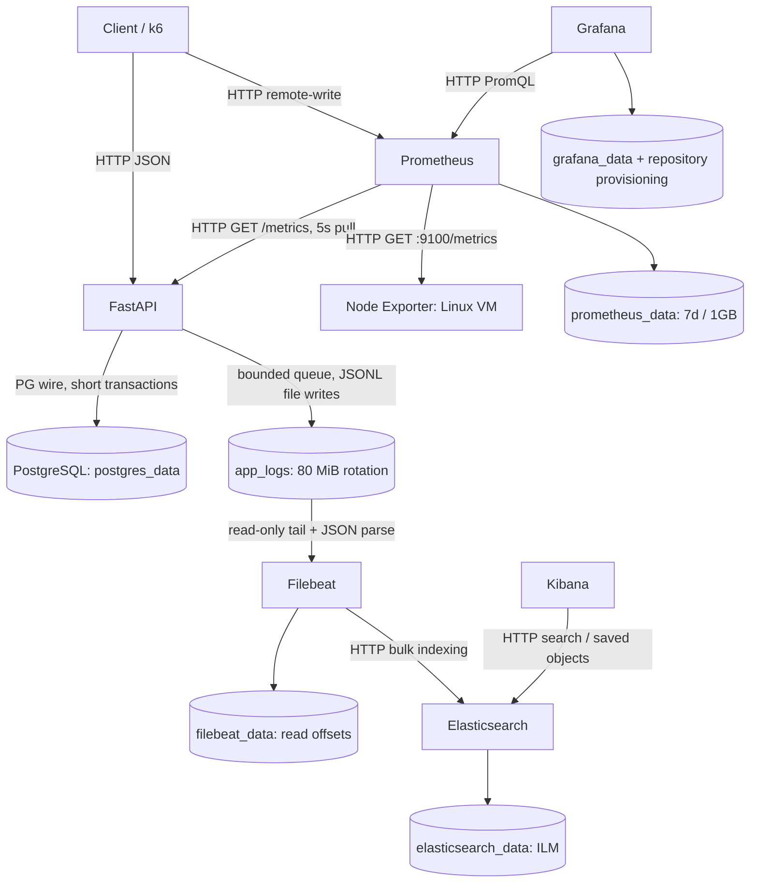

# Enterprise Software Development Assignment 1: Observability

Project: **Campus Room Booking Service**. Deployment target: local Windows + Docker Desktop Linux containers. This report distinguishes implementation, predicted behavior, and measured evidence. See [verification record](VERIFICATION-2026-09-21.md) for the exact checks actually run. Docker measurements and selected raw evidence are preserved in `docs/evidence/docker/`. Only actual browser screenshots remain to be captured manually.

# Part A — Project

**Problem.** Students need a reliable way to reserve study/group rooms without two people receiving overlapping reservations. Merely reading availability before inserting is unsafe when users arrive concurrently.

**Intended users.** University students using Swagger or an HTTP client, and teaching staff evaluating concurrency, performance, observability, and recovery. Authentication and student identity are outside this local demonstration; no personal information is stored.

**Solution.** FastAPI exposes rooms, availability, booking creation/fetch/list/cancellation, liveness, readiness, and metrics. PostgreSQL enforces non-overlap with a partial GiST exclusion constraint on room ID and a UTC timestamp range. Cancelled reservations retain history and release the slot. Transactions and bounded connection pools support concurrent requests. All public ports bind to loopback.

**What works / evidence.** API, service, and repository layers are implemented; the schema and seed are deterministic. Automated unit and real-database test cases exist. Actual executed results and any environment restrictions are in `docs/VERIFICATION.md`. Static configuration is not equivalent to a verified running pipeline.

**How to try it.** Copy `.env.example` to `.env`, run `docker compose up --build -d --wait --wait-timeout 300`, then open http://localhost:8000/docs. Run `powershell -ExecutionPolicy Bypass -File scripts/smoke.ps1`. Full commands and all URLs are in the README. The smoke script creates, reads, deliberately conflicts, and cancels a booking with request ID `demo-booking-001`.

# Part B — Metrics

Metrics are declared in `app/observability/metrics.py::Metrics`. The HTTP middleware is `app/observability/middleware.py::ObservabilityMiddleware.__call__`. Repository timers wrap actual database work including pool checkout and commit. Labels are fixed categories: normalized route, a bounded method set, standard status, or a named repository operation. Business identifiers and timestamps are never production metric labels.

The table gives a query suitable for this single application target. Dashboard application queries additionally scope `job="campus-app"` where needed. `rate` handles process counter resets. All rates use seconds as the denominator.

| Name | Purpose / type / unit / labels | Where and when recorded | PromQL | Grafana panel / interpretation |
|---|---|---|---|---|
| `http_requests_total` | Throughput and result distribution; Counter; requests; `method,route,status` | Middleware `finally`, once per completed or failed measured request | `sum(rate(http_requests_total[1m]))` | Requests per second; split by status/route to locate failures. 2xx success, 409 domain contention, 422 validation, 5xx infrastructure/application failure. |
| `http_requests_in_progress` | Concurrency; Gauge; requests; `method,route` | Middleware increments before work, decrements in `finally` including failures/timeouts | `sum(http_requests_in_progress)` | In-flight requests; sampled gauge can miss sub-scrape spikes. Rising values with latency suggest waiting. |
| `http_request_duration_seconds` | Latency distribution; Histogram; seconds; `method,route,status` | Middleware observes monotonic end minus start in `finally` | `histogram_quantile(0.95,sum by(le)(rate(http_request_duration_seconds_bucket[5m])))` | p95/p99 request latency, route p95, average. p99 replaces 0.95 with 0.99; average is `sum(rate(..._sum[5m])) / sum(rate(..._count[5m]))`. |
| `db_operation_duration_seconds` | Repository latency; Summary; seconds; `operation` | `Metrics.db_timer` used by each repository method, observes success/failure in `finally` | `sum by(operation)(rate(db_operation_duration_seconds_sum[5m])) / clamp_min(sum by(operation)(rate(db_operation_duration_seconds_count[5m])),0.000001)` | DB operation average latency; includes pool wait, SQL, row handling and commit. Does not isolate which stage was slow. |
| `bookings_created_total` | Accepted reservations; Counter; bookings; none | `BookingService.create`, after repository commit | `sum(rate(bookings_created_total[1m]))` | Booking creation rate; transaction failures never count as success. |
| `bookings_cancelled_total` | Released reservations; Counter; transitions; none | `BookingService.cancel`, only if a committed confirmed→cancelled update occurred | `sum(rate(bookings_cancelled_total[1m]))` | Booking cancellation rate; idempotent retries do not increment twice. |
| `booking_conflicts_total` | Room contention; Counter; conflicts; none | `BookingService.create` catches DB SQLSTATE `23P01` | `sum(rate(booking_conflicts_total[1m]))` | Booking conflict rate; business rejection distinct from 5xx. |
| `active_bookings` | Outstanding reservations; Gauge; bookings; none | `main.refresh_business_metrics`, DB count every 5s where confirmed and end > now | `active_bookings` | Active bookings; reconstructed after restart, eventually consistent, includes future reservations. |
| `booking_metrics_refresh_success` | Reliability of preceding gauge; Gauge; 0/1; none | Background refresh sets 1 on success or 0 on DB failure | `booking_metrics_refresh_success` | Business gauge refresh health; 0 means active count may be stale. |
| `booking_metrics_last_refresh_timestamp_seconds` | Gauge freshness; Gauge; Unix seconds; none | Successful background refresh only | `time() - booking_metrics_last_refresh_timestamp_seconds` | Business gauge refresh health; age >10s deserves investigation. Timestamp is a value, not a label. |
| `booking_lead_time_seconds` | Advance booking behavior; Histogram; seconds; none | Service after create commit observes max(0, start−UTC now) | `sum(rate(booking_lead_time_seconds_sum[5m])) / clamp_min(sum(rate(booking_lead_time_seconds_count[5m])),0.000001)` | Mean booking lead time; synthetic load dates influence this metric. |
| `fault_injections_total` | Confirms deliberate slowdowns; Counter; delays; none | Middleware every Nth relevant request while local fault is on | `sum(rate(fault_injections_total[1m]))` | Injected delays per second in load dashboard; useful for causal alignment. |
| `logging_dropped_total` | Detects telemetry loss; Counter; records; none | `logging.NonBlockingHandler.emit`, full bounded queue | `sum(rate(logging_dropped_total[1m]))` | Log pipeline local loss; a fast API can still be losing telemetry. |
| `logging_sink_errors_total` | Failed log writes; Counter; failures; none | Safe rotating/stream handlers or log-file creation failure | `sum(rate(logging_sink_errors_total[1m]))` | Log pipeline local loss; inspect file permissions/disk/stdout. |
| `process_resident_memory_bytes` | App resource footprint; Gauge; bytes; none | prometheus-client ProcessCollector, on scrape (Linux) | `process_resident_memory_bytes{job="campus-app"}` | App resident memory; different scope from VM memory. |
| `process_cpu_seconds_total` | App CPU work; Counter; seconds; none | ProcessCollector, on scrape (Linux) | `rate(process_cpu_seconds_total{job="campus-app"}[1m])` | App CPU cores used; 1 = one busy core. |
| `python_gc_objects_collected_total`, `python_gc_objects_uncollectable_total`, `python_gc_collections_total` | Runtime GC activity; Counters; objects or collections; `generation` | Built-in GCCollector on scrape | `rate(python_gc_collections_total[5m])` | Explore in Prometheus if investigating allocation/GC; no dedicated panel. |
| `python_info` | Runtime inventory; Info (constant gauge); 1; `implementation,major,minor,patchlevel,version` | PlatformCollector, fixed process runtime | `python_info` | Prometheus Explore; fixed labels identify runtime, no per-request series. |
| Other `process_*` collector samples | Virtual memory, FDs, start time; Gauges; bytes/count/epoch; none | ProcessCollector, OS-dependent scrape | `process_open_fds{job="campus-app"}` | Prometheus Explore; supplementary runtime diagnostics. |
| `node_cpu_seconds_total` | VM CPU; Counter; seconds; `cpu,mode` + target `machine` | Node Exporter kernel CPU collector | `100*(1-avg by(machine)(rate(node_cpu_seconds_total{mode="idle"}[1m])))` | VM CPU usage on load and node dashboards. |
| `node_memory_MemAvailable_bytes`, `node_memory_MemTotal_bytes` | VM memory; Gauges; bytes; target labels | Node Exporter memory collector | `100*(1-node_memory_MemAvailable_bytes/node_memory_MemTotal_bytes)` | VM memory usage; reclaimable memory reflected by available. |
| `node_filesystem_avail_bytes`, `node_filesystem_size_bytes` | Linux mount capacity; Gauges; bytes; `device,mountpoint,fstype` | Node Exporter filesystem collector | `100*(1-node_filesystem_avail_bytes/node_filesystem_size_bytes)` | Disk usage (panel excludes ephemeral filesystems); Linux-visible mounts may include shared Windows drives, not general Windows telemetry. |
| `node_disk_read_bytes_total`, `node_disk_written_bytes_total` | Device I/O; Counters; bytes; `device` | Node Exporter disk collector | `rate(node_disk_read_bytes_total[1m])` (and written counterpart) | Disk I/O; high rates alone do not prove saturation. |
| `node_network_receive_bytes_total`, `node_network_transmit_bytes_total` | Network activity; Counters; bytes; `device` | Node Exporter netdev collector | `rate(node_network_receive_bytes_total{device!="lo"}[1m])` | Receive/transmit; Docker network namespace scope must be checked. |
| `k6_vus` | Applied load; Gauge; users; bounded profile/phase/scenario tags | k6 remote write every 5s | `k6_vus` | k6 virtual users; compare changing demand to throughput. |
| `k6_http_req_duration_p95`, `..._p99` | Client latency; percentile Gauges; seconds; bounded name/method/status/scenario/phase/profile | k6 Trend converted for Prometheus remote write | `k6_http_req_duration_p95` | Client p95/p99; do not aggregate percentiles across series. |
| `k6_unexpected_responses_rate` | Unexpected business responses; Rate converted to Gauge; fraction; bounded test tags | `load-tests/common.js::request`, each checked business response | `k6_unexpected_responses_rate` | Unexpected response fraction; deliberate 409 is expected only on its designated request. |
| `k6_expected_conflicts_total` | Controlled contention volume; Counter; conflicts; bounded test tags | k6 successful deliberate 409 checks | `rate(k6_expected_conflicts_total[1m])` | Explore to compare injected conflict traffic with business counter. |
| `demo_requests_total` | **Isolated teaching metric**; Counter; requests; `request_id` only in high mode, none in low mode | Separate `experiments/cardinality.py`, max 100 events per process | `count(demo_requests_total)` | Prometheus graph for E2; never added to app registry. |

Standard exporter/runtime collectors expose additional diagnostics. They are infrastructure-provided metrics, not custom business metrics; recording depends on the platform. `up{job=...}` is generated by Prometheus from scrape success, and `prometheus_tsdb_head_series` comes from its own scrape, useful during E2.

**All four types.** Counters monotonically accumulate until process restart. Gauges rise and fall. Histograms expose cumulative buckets plus sum/count. Python's client Summary exposes sum/count but no quantile estimator. Percentiles therefore use Histograms. Buckets are 5, 10, 25, 50, 100, 250, 500 ms, 1, 2.5, 5, 10 seconds and +Inf. The 500 ms injected delay should shift observations to larger buckets. Percentiles are estimates interpolated within buckets; sparse data and broad buckets limit precision.

**Time windows.** `[5m]` selects five minutes of counter samples at each evaluation time. `rate` estimates per-second increments over those samples, correcting for counter resets. It is not a five-minute refresh interval. Scrapes and dashboard refresh are 5 seconds; throughput uses 1 minute for demo responsiveness, quantiles/DB means use 5 minutes for stability. Empty denominators are clamped for ratios but an empty histogram cannot honestly produce a useful percentile.

**Own exploration.** The panel *Booking conflict percentage (own exploration)* computes:

```promql
100 * sum(rate(booking_conflicts_total[5m])) /
clamp_min(sum(rate(booking_conflicts_total[5m])) + sum(rate(bookings_created_total[5m])), 0.000001)
```

This tells us whether accepted and conflicting attempts are dominated by competing room demand. High contention with normal DB latency suggests room scarcity or intentionally colliding traffic. High latency/in-flight counts with 503s instead points toward pool/database pressure. It is not a server-error percentage or a denominator containing invalid requests.

**Measured machine.** The Node Exporter target label is `machine="docker-desktop-linux-vm"`. Mounted Linux proc/sys/root give VM CPU/memory/disks where Docker permits them. Windows host metrics are not claimed. Network counters may reflect the exporter's Docker namespace; inspect interface labels and document the visible scope.

# Part C — Logs

`app/observability/logging.py::JsonFormatter` formats allowlisted fields as one JSON object per line. `ObservabilityMiddleware.__call__` assigns a safe request ID, observes response status/duration, and logs `request_completed` even on handled errors. `main.database_error` logs correlated DB failures using class name only. The fault injector emits a warning with the same ID as the eventual request completion. No SQL strings, passwords, authorization, raw URLs/query strings, bodies, or personal information are logged.

The writer thread accepts at most 4096 queued records. API requests use `put_nowait`; a full queue increments a drop counter. File and stdout writes occur off the request event loop. File open/write failures are measured and do not stop the API. Shutdown attempts a bounded two-second drain. Abrupt shutdown or persistent I/O problems can lose records, and those limits are disclosed.

Filebeat reads `/var/log/campus/app.jsonl*` from the read-only shared `app_logs` volume. NDJSON decoding puts `request_id`, `route`, numeric `status_code`, numeric `duration_ms`, and other fields at the root. Its timestamp processor copies the original UTC event time to Elasticsearch's `@timestamp`, avoiding ingestion-time-only searches. Explicit mappings in `observability/elasticsearch/index-template.json` avoid ECS's object-valued `service` conflict with our scalar service string. Unknown metadata remains in `_source` but is not dynamically indexed. Filebeat uses a bounded 2048-event queue, capped reconnect backoff, and persisted read offsets.

**Storage and retention.** `app_logs` holds current + seven 10 MiB rotated files; this is a roughly 80 MiB capacity, not seven days. `filebeat_data` holds offsets. `elasticsearch_data` holds indices and Kibana saved objects. These named volumes survive container restart and recreation, and `docker compose down`; `down -v` deletes them. Docker stdout logs are separately size-limited and disappear when their container is removed. Elasticsearch ILM rolls a write index after 1 day or 1 GB, then deletes it 7 days after rollover. Thus normal event retention is roughly 7–8 days with periodic ILM checks, not exact per-event expiration. A long shipper outage can exceed local rotation retention. Delivery is at least once when retained data is replayed; duplicates are possible.

**Original record and stored form.** A real locally generated request log is included in `docs/VERIFICATION.md` when available. Full Filebeat→Elasticsearch evidence must be generated using `docker compose exec -T app python scripts/verify-stack.py`. Its JSON output contains an actual Elasticsearch hit and the original correlation fields. The stored document must retain the original fields and gain `@timestamp` plus Filebeat metadata. The verifier asserts fields/types and policy attachment. Do not paste this illustrative transformation as measured evidence:

```text
Original JSONL: timestamp, service, severity, message, request_id, method,
               route, status_code, duration_ms, operation
  -> ndjson parsing -> typed root fields
  -> timestamp processor -> @timestamp
  -> HTTP _bulk -> campus-logs write alias -> campus-logs-00000N
  -> Kibana data view campus-logs-* using @timestamp
```

Actual stored hit: [Docker pipeline evidence](evidence/docker/stack-verification.json), request `verify-eb604ba0-b5a9-49fb-b080-f2c46ad17542`, POST `/bookings`, 201, 12.034 ms, indexed at `2026-09-21T09:22:53.777Z`. **[MANUAL SCREENSHOT: Kibana Discover showing this stored document]**. The query/mapping is verified; browser rendering has not been captured.

**Useful searches.** `request_id : "demo-booking-001"` follows one request. `severity : "ERROR"` or `status_code >= 500` finds failures. `route : "/bookings" and status_code : 409` finds domain contention. `message : "fault_delay_injected"` proves the local fault was enabled. A duration search `duration_ms >= 500` identifies affected user requests. Set the Kibana time picker to the actual experiment's UTC window. See `observability/kibana/queries.md` for combined searches and exact setup.

# Part D — System Design



**Design choices.** One application, one database, one Uvicorn worker. An async SQLAlchemy engine is created once during lifespan, disposed at shutdown, and pooled (10 steady connections + up to 5 overflow; 2-second pool wait). PostgreSQL caps connections at 60. Query statement timeout is 3 seconds, lock timeout 2 seconds, connection timeout 3 seconds, overall request timeout 10 seconds, and idle transaction timeout 5 seconds. Uvicorn limits concurrent connections/tasks to 512; its own overload 503s happen before app middleware and are visible to k6 but may not appear in app HTTP counters. No per-request engine construction, unbounded DB pool, network log writes in the request path, or N+1 room query pattern is used.

Readiness checks a known schema version through the actual DB; liveness only confirms the running process. Compose gates startup on health where useful, and application-level errors/timeouts still handle later failures. Startup schema creation uses a transaction and advisory lock; unsupported schema versions fail explicitly. This is deterministic version-1 initialization, not a full migration framework. Unexpected exceptions return a safe correlated 500; DB availability errors return 503 with `Retry-After: 2`; request time budget expiry returns 504. Clients must distinguish a failed response from proof that a commit did not occur.

| Failed component | User/system effect | Detection and recovery |
|---|---|---|
| Grafana | Booking and collection continue; charts inaccessible | `/api/health`, restart Grafana; provisioning and volume restore views. |
| Prometheus | Booking/logging continue; scrape history has gaps; k6 remote-write unavailable | Target/UI unavailable; restart. Unscraped transient distributions cannot be reconstructed; counters retained in still-running app may span gap. |
| Filebeat | Booking and local logging continue; searchable logs lag | Filebeat health/logs; restart and resume offsets while files remain. Rotation may cause data loss. |
| Elasticsearch | Booking/local logs continue; Filebeat backs off; Kibana searches fail | Cluster health, Filebeat output errors; restart. Finite queues/files limit backlog. |
| Kibana | Booking and Elasticsearch ingestion continue; Discover inaccessible | Kibana status; restart; saved view remains in Elasticsearch. |
| PostgreSQL | DB-backed endpoints fail 503/504; readiness fails; liveness/metrics remain reachable | DB logs, DB timer, 5xx, stale gauge; restart PostgreSQL, pre-ping replaces dead connections. |
| Node Exporter | Booking/app metrics continue; resource charts develop gaps | `up{job="node-exporter"}=0`; restore mounts/exporter. Do not interpret missing metrics as zero usage. |
| Application | Booking unavailable; other monitoring/log storage remain | App scrape `up=0`, connection errors, container logs; restart reads persistent DB. Counters reset; active gauge reloads. |

**Metric journey: `http_request_duration_seconds`.**

1. A booking request enters `app/observability/middleware.py::ObservabilityMiddleware.__call__`; `started = perf_counter()` establishes a monotonic start before injected delay and handler work.
2. The `finally` block computes elapsed seconds and calls `metrics.duration.labels(method, route, str(status)).observe(elapsed)` once, using a normalized `/bookings` label.
3. `/metrics` serializes the registry via `prometheus_client.generate_latest`. The histogram has cumulative `_bucket{le=...}`, `_sum`, `_count`, and a companion creation timestamp.
4. `observability/prometheus/prometheus.yml` pulls `http://app:8000/metrics` every 5 seconds, attaching `job="campus-app"` and target labels.
5. Prometheus appends samples to its WAL/head and TSDB blocks on `prometheus_data`. The value is not pushed to Grafana by the app.
6. Grafana queries `histogram_quantile(0.95, sum by(le)(rate(http_request_duration_seconds_bucket{job="campus-app"}[5m])))` using the provisioned datasource.
7. `campus-app.json` panel *p95 request latency* renders the estimate in seconds; *p99 request latency* uses 0.99. Route p95 groups by both `le` and `route`.

Concrete **arithmetic illustration, not a measured request**: if a single POST takes 0.037 seconds with status 201, buckets at 0.05 seconds and above increment by 1, buckets below do not, `_sum` increases by 0.037, and `_count` by 1. The emitted bucket line has the shape:

```text
http_request_duration_seconds_bucket{le="0.05",method="POST",route="/bookings",status="201"} 1.0
http_request_duration_seconds_sum{method="POST",route="/bookings",status="201"} 0.037
http_request_duration_seconds_count{method="POST",route="/bookings",status="201"} 1.0
```

An actual histogram/Prometheus sample captured during verification belongs in the verification record; screenshot evidence remains a separate real-run requirement.

**Log journey: a booking.** Client sends `X-Request-ID: demo-booking-001`; middleware validates and reuses it. The booking transaction commits (201). Middleware constructs allowlisted structured fields including method, template route, status, elapsed milliseconds, and the ID. `JsonFormatter` serializes a JSON line. A queue worker writes it to stdout and `app_logs`. Filebeat tails the file using persisted offsets, decodes NDJSON, converts event time to `@timestamp`, and sends a bulk HTTP request to the `campus-logs` alias. Elasticsearch maps fields (keywords and numbers) and stores the document on `elasticsearch_data`; ILM manages its backing index. Kibana's `campus-logs-*` data view searches `request_id : "demo-booking-001"`. The final Discover result must show the same ID, POST `/bookings`, 201, and the original duration. `verify-stack.py` verified the full pipeline. The indexed request `verify-eb604ba0-b5a9-49fb-b080-f2c46ad17542` at `2026-09-21T09:22:53.777Z` is POST `/bookings`, status 201, duration 12.034 ms in `campus-logs-000001`; see [stored document and ILM attachment](evidence/docker/stack-verification.json).

**Limitations understood.** Single-process metrics do not automatically aggregate across workers; size-bounded local logging can lose events; server and client timers measure different scopes; histogram quantiles are approximate; a five-second scrape can miss brief gauge peaks; a Summary mean cannot identify a tail percentile; active reservations are not utilization. Node Exporter does not magically monitor Windows. SQL latency currently combines pool wait and execution, so proving a pool bottleneck requires DB inspection in addition to the summary. Bootstrap is not an upgrade migration. Internet-facing security, durable idempotency keys, high availability, and audit-grade log delivery are outside this local project.

# Part E — Experiments

## E1 Reproduce a Problem

**Normal.** Run the default fault-free stack and a 10-VU two-minute baseline. Requests perform real business operations; deliberate 409s count separately from unexpected errors. Capture baseline CPU/memory and client/server rates/tails.

**Prediction.** Every fifth measured business request awaits 500 ms. Approximate additive mean delay is 0.2 × 0.5 = **0.1 seconds** under a stable request mix; this is a prediction, not a measurement. p95/p99 should rise because 20% of requests are slowed. More requests may be in flight. With fixed VUs, throughput can decrease because users wait longer. CPU need not rise much because the delay is an async sleep. DB average latency should remain similar unless secondary contention changes it. 409/422 are not expected to become 500s merely because the fault is on.

**Fault and exact commands.**

```powershell
powershell -ExecutionPolicy Bypass -File scripts/run-anomaly-experiment.ps1
```

Bash: `bash scripts/run-anomaly-experiment.sh`. Automation runs baseline/fault/recovery with identical 10-VU profiles, records actual UTC phase boundaries and exit codes, and saves JSON summaries in `results/<UTC-run>/`. It uses 310-second quiet intervals to clear a 5-minute dashboard window. Fault injection is process-local, local-environment-only, bounded to at most 2000 ms, and disabled by cleanup even after failed thresholds. The default is 500 ms every fifth business request.

**Queries.** p95/p99 from Part B; `sum(rate(fault_injections_total[1m]))`; `sum(http_requests_in_progress)`; HTTP throughput and 5xx percentage; DB operation mean. Kibana: `message : "fault_delay_injected"`, then copy its request ID into a second search and compare `request_completed.duration_ms`. App restart resets counters; use rates and the saved boundaries. The screenshot's UTC interval should match that phase's JSON summary.

| Phase | UTC start/end | Requests/s | Client p95 / p99 | Unexpected errors | CPU / memory | Result |
|---|---|---|---|---|---|---|
| Docker baseline | 15:32:31.725–15:34:34.224 | 160.93 | 50.22 / 68.51 ms | 0.00% | 8.37% / 19.57% | Passed |
| Docker fault | 15:39:48.301–15:41:52.915 | 65.37 | 519.67 / 528.55 ms | 0.00% | 5.75% / 19.44% | Passed |
| Docker recovery | 15:47:07.301–15:49:10.557 | 150.00 | 58.73 / 74.90 ms | 0.00% | 7.27% / 19.47% | Passed |

The earlier native Windows results are archived separately in `docs/VERIFICATION-NATIVE.md`. The table above is the actual Docker/ELK run, with identical 10-VU two-minute workloads and 310-second inter-phase quiet intervals.

**Cause/user effect.** Correlated fault logs establish deliberate waiting as a cause; latency alone cannot establish it. Compare DB mean to HTTP tails to distinguish the injected application wait from SQL slowdown. Users receive valid results more slowly. A decreasing request rate under closed-loop load does not automatically mean fewer incoming users.

**Recovery.** The final phase recreates the app with the fault disabled and reruns the same load. Verify no new fault counter increments/logs, readiness 200, and client tails moving back toward baseline; do not demand exact equality on a noisy shared machine. If the shell was hard-killed, use the README's explicit fault-off command. Recovery client p95/p99 returned to **58.73/74.90 ms**, with zero unexpected responses and zero new fault logs in the recovery interval. The app was recreated fault-free by script cleanup and readiness returned 200. Elasticsearch indexed **1,590** `fault_delay_injected` records in the fault interval and none in baseline or recovery. Request `e6b72c73-7092-4008-9ad4-f019f6500802` has the 500 ms injection warning and a matching `GET /bookings/{booking_id}` completion of **508.860 ms**, status 200. This ties the observed slowdown to the deliberate wait. See [indexed correlation](evidence/docker/experiment-logs.json). **[MANUAL SCREENSHOTS: baseline, fault, recovery Grafana panels and correlated Kibana documents]**. All table intervals are 2026-09-21 UTC; CPU/memory describe sampled VM usage. Raw k6 summaries and Prometheus series are in `docs/evidence/docker/anomaly/`. Server histogram quantiles are interpolated within buckets; the 0.5–1 second bucket can overestimate the roughly 520 ms fault tail.

**Increasing users.** Run `docker compose --profile load run --rm -e SUMMARY_FILE=/results/load.json k6 run -o experimental-prometheus-rw /scripts/load.js`. Record each 10/25/50/100/200-VU plateau's UTC window, throughput, p95, p99, 5xx, unexpected response fraction, in-flight count, DB mean, and Linux VM CPU/memory. Use identical allocated resources and one generator. A plateau in throughput together with rising latency/waiting suggests saturation; confirm with resource and DB evidence before changing pools. Two-minute plateaus are shorter than five-minute quantile windows; for cleaner per-stage tails, increase holds beyond five minutes or use k6 per-run summaries in separate fixed-VU runs. Actual Docker run: **2026-09-21 09:37:45.296–09:50:47.462 UTC**, 223,460 HTTP requests, 286.48 requests/s overall, client p95 **828.67 ms**, p99 **1,388.89 ms**, and **271/223,459 unexpected checked responses (0.1213%)**. Whole-run thresholds passed but the 200-user stage was degraded. Stable-stage sample means were 153.58, 215.72, 376.36, 357.01 and 333.06 server requests/s at 10, 25, 50, 100 and 200 VUs respectively. The corresponding sampled one-minute server p95 estimates were 48.67, 230.15, 230.33, 693.93 and 1,925.26 ms. Throughput ceased improving beyond the observed 50-user plateau. At 200 VUs, in-flight requests averaged 189.08, repository mean 465.36 ms and 5xx rate 2.07/s; app CPU stayed around 1.04 cores, VM CPU 14.27%, and VM memory 20.60%. Correlated `TimeoutError`/503 logs identify exhausted pool wait budgets. This indicates a limit in this single-worker/pool configuration, not a proved standalone SQL bottleneck or universal user limit. Exact sample windows, p99s, resources and methodology are in [verification](VERIFICATION-2026-09-21.md) and [stage evidence](evidence/docker/load-stages.json).

## E2 Cardinality Explosion

`experiments/cardinality.py` runs as a separate optional process on port 8010. In high mode, a unique random `request_id` label is added to `demo_requests_total` for each request. It accepts **at most 100 events**, and the 101st returns 429. Metrics scrapes do not generate IDs.

```powershell
powershell -ExecutionPolicy Bypass -File scripts/run-cardinality-experiment.ps1
```

Bash: `bash scripts/run-cardinality-experiment.sh`. The script starts high mode, makes exactly 100 calls, and waits for an actual Prometheus instant query to report 100. It then sets `DEMO_HIGH_CARDINALITY=false`, recreates the demo (removing the label from the counter definition), makes another 100 calls, and waits for the current count to become 1 after a scrape/staleness update. It saves counts and actual UTC timestamps. It leaves the low-mode demo running for screenshots.

```promql
count(demo_requests_total{job="cardinality-demo"})
sum(demo_requests_total{job="cardinality-demo"})
prometheus_tsdb_head_series
```

Expected: value-series count **100 → 1**, while total counted events in each process equals 100. This is the hypothesis; the script asserts actual observed counts. The Python client also emits `_created` series, so total exporter series growth is larger than `count(demo_requests_total)` alone. Production metrics never receive the ID label.

The actual Docker cardinality script accepted 100 events per mode and Prometheus returned **100 → 1** current value series at **15:49:30.601 → 15:49:39.952 UTC** on 2026-09-21. The total counter value was 100 in each process; the low-mode 101st event returned 429. The low-cardinality demo remains running, and the historical high-cardinality samples remain queryable. See [actual query evidence](evidence/docker/cardinality.json). **[MANUAL SCREENSHOT: Prometheus historical count graph over both modes]**.

Removing a label and restarting the exporter does **not** erase stored history. After a successful new scrape, missing old label sets are stale in instant vectors, while historical range queries and TSDB storage still include them until retention/compaction. A `/series` metadata query or head-series count can therefore remain high; that does not contradict the new instant count of 1.

At scale, unique IDs create roughly one additional label set per request (and companion metric series); multiplying identifiers across histogram buckets is worse. The memory cost includes active series metadata, labels, WAL writes, chunks, disk history, network payload, and query work. No exact bytes-per-series claim is made because it depends on Prometheus/version/workload. Request IDs belong in logs where lookup by one identifier is useful; aggregate metrics should describe bounded categories.

## Primary references

- [PostgreSQL range exclusion constraints](https://www.postgresql.org/docs/16/rangetypes.html#RANGETYPES-CONSTRAINT) — database-backed non-overlap design.
- [Python prometheus-client Summary](https://prometheus.github.io/client_python/instrumenting/summary/) — sum/count and absent client quantiles.
- [Filebeat filestream and NDJSON](https://www.elastic.co/guide/en/beats/filebeat/8.19/filebeat-input-filestream.html) — line decoding and file-tail behavior.
- [Elasticsearch ILM rollover](https://www.elastic.co/guide/en/elasticsearch/reference/8.19/ilm-rollover.html) — lifecycle/rollover semantics.
- [k6 Prometheus remote write](https://grafana.com/docs/k6/latest/results-output/real-time/prometheus-remote-write/) — mapping of VUs, rates, and trend percentiles to Prometheus.

These sources explain design choices. They are not evidence that this particular deployment or experiment succeeded.
