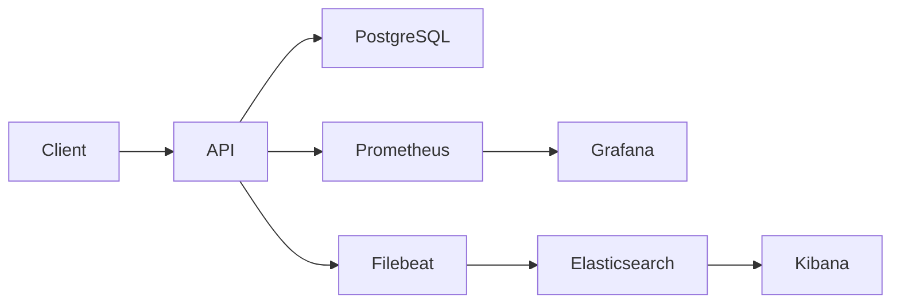

# Campus Room Booking Service

## Part A - Project

**Problem and users.** Students need to reserve campus study rooms without double bookings. Teaching staff need reproducible evidence of concurrency correctness, system performance, and fault diagnosis.

**Solution.** A small FastAPI API lists rooms, checks availability, creates/reads/cancels bookings, and exposes Swagger as its UI. PostgreSQL enforces half-open UTC reservation intervals with a partial GiST exclusion constraint. Availability checks alone are not trusted under concurrency. Cancelling retains history and releases the slot. The API/service/repository structure separates HTTP validation, business rules and transaction boundaries.

Fresh validation: **26 tests passed in 3.46 seconds**; the real Docker same-slot race returned **1 winner / 19 conflicts**, with clean 409 responses rather than 500s. Tests independently check persisted row count, direct SQL overlap protection, adjacent slots, validation, timeouts and cancellation idempotence. Evidence references: screenshots 02, 13 and 14.

## Part B - Metrics

Prometheus scrapes every five seconds. Grafana provisions three dashboards with 40 panels and 46 real-data expressions. Middleware records completed business requests using monotonic elapsed time; `finally` decrements in-flight requests. Health, readiness, metrics and documentation traffic do not inflate business throughput. Labels use bounded method/status/route templates or named DB operations; request IDs, user IDs and booking IDs are not production metric labels.

| Metric / type | What it measures and where | Interpretation / unit |
|---|---|---|
| http_requests_total / Counter | Middleware completion, labels method/route/status | Requests; rate gives requests/s. Separate 2xx, 409/422 and 5xx. |
| http_requests_in_progress / Gauge | Middleware entry/finally | Concurrent requests; sampled values may miss short peaks. |
| http_request_duration_seconds / Histogram | Middleware elapsed time; cumulative buckets, sum/count | Seconds; supports estimated p95/p99 and means. |
| db_operation_duration_seconds / Summary | Repository timer around checkout, SQL, row handling and commit | Seconds; sum/count yields mean, not a tail quantile or isolated SQL time. |
| bookings_created_total / Counter | Service after committed creation | Accepted reservations; failed transactions do not count. |
| bookings_cancelled_total / Counter | Committed confirmed-to-cancelled transition | Counts a transition once, including concurrent retries. |
| booking_conflicts_total / Counter | Service handling PostgreSQL exclusion violation | Domain contention, distinct from a server error. |
| active_bookings / Gauge | DB refresh every five seconds | Confirmed future/current reservations; not room occupancy. |
| booking_metrics_refresh_success and last_refresh timestamp / Gauges | Background refresh | Gauge validity and freshness; inspect before trusting active count. |
| booking_lead_time_seconds / Histogram | Successful create, start minus current UTC | Seconds of advance booking; synthetic dates affect the mean. |
| fault_injections_total / Counter | Middleware when a deliberate delay is applied | Confirms the injected cause. |
| logging_dropped_total / logging_sink_errors_total / Counters | Bounded log queue and writer | Detect local telemetry loss; not all downstream loss. |
| process_* / Node Exporter | App process; Docker Linux/WSL2 kernel/mounts | CPU cores, bytes, disk/network rates; scopes differ. |
| k6_vus / client p95/p99 / unexpected Rate | k6 remote write | Applied users, client timing in seconds in Prometheus, unexpected response fraction. |

Counters accumulate until process restart; `rate` handles resets. Gauges can rise/fall. Histograms retain cumulative buckets; Python Summary exposes count/sum without client quantiles. Server histogram buckets span 5 ms to 10 seconds plus infinity. The 0.5-1 second bucket can interpolate a fault-tail estimate higher than the roughly 0.5-second direct timings.

Core queries:

```promql
sum(rate(http_requests_total{job="campus-app"}[1m]))
histogram_quantile(0.95, sum by(le)(rate(http_request_duration_seconds_bucket[5m])))
histogram_quantile(0.99, sum by(le)(rate(http_request_duration_seconds_bucket[5m])))
sum(rate(http_request_duration_seconds_sum[5m])) / clamp_min(sum(rate(http_request_duration_seconds_count[5m])), 0.000001)
sum(rate(db_operation_duration_seconds_sum[5m])) / clamp_min(sum(rate(db_operation_duration_seconds_count[5m])), 0.000001)
```

`[5m]` is a look-back window, not the refresh interval. Server and client timers have different boundaries. Client percentiles must not be averaged across routes. All dashboard queries were exercised against fresh Prometheus data, including zero-valued error series.

**Own exploration: Booking conflict percentage.** The application dashboard computes `100 * conflict_rate / (conflict_rate + creation_rate)` over five minutes. It reveals contention among booking attempts; a high value with low DB latency can reflect room demand or deliberate collision traffic, not infrastructure failure. Evidence: screenshots 03-08.

## Part C - Structured logs

Each measured completion includes UTC timestamp, service, severity, message, safe request_id, normalized route, method, status_code, duration_ms and operation. Error records include a bounded error class, without exception strings, request bodies, credentials or personal information. A valid X-Request-ID is reused; invalid or missing IDs are replaced. The same ID joins a fault/error with the completion record.

A bounded 4,096-entry queue keeps log-file I/O off the event loop. Queue overflow and sink errors are counted. A writer emits JSONL to stdout and a shared named volume. Filebeat tails the file, decodes NDJSON, copies the original timestamp into `@timestamp`, and sends typed fields to Elasticsearch. Kibana searches the `campus-logs-*` data view. Mappings keep status/duration numeric and IDs/routes searchable.

Fresh real document: `verify-0c74ea91-41be-4bab-864b-80388a2d07d4`, timestamp `2026-09-23T04:19:55.674Z`, `POST /bookings`, HTTP 201, 7.573 ms. Exact KQL: `request_id : "verify-0c74ea91-41be-4bab-864b-80388a2d07d4"`. Screenshot 09 shows this document; screenshot 15 correlates the injected delay.

App files retain current plus seven 10 MiB rotations, about 80 MiB by size. Docker stdout has separate limits. Filebeat offsets and Elasticsearch data persist in named volumes. ILM rolls a write index after one day or 1 GB, then deletes it seven days after rollover; attachment is verified, eventual deletion is not. Long outages can exceed local rotation retention; replay can duplicate retained records. Delivery is best effort, not audit-grade.

## Part D - System design



The API is the business endpoint; PostgreSQL is its only required runtime dependency. Prometheus stores metric samples in its WAL/TSDB and Grafana stores dashboard/configuration state. Filebeat ships file records; Elasticsearch indexes them and stores Kibana saved objects. Named volumes survive restarts and normal Compose down. Deleting volumes is destructive and is never required for a restart.

**Metric journey.** A completed POST observes the duration histogram and request counter; `/metrics` exposes current cumulative samples; Prometheus scrapes and stores them; Grafana queries rates and bucket quantiles and renders the result. The visual baseline dashboard and its API queries both returned real data.

**Log journey.** The request's correlation ID enters middleware, survives the committed transaction and completion record, is written as JSONL, parsed by Filebeat, stored with numeric fields in Elasticsearch, and searched through Kibana. The fresh verification script retrieved the actual stored hit.

| Failure | Expected effect | Interpretation |
|---|---|---|
| API or PostgreSQL unavailable | Bookings fail; readiness detects DB failure while liveness may stay up | Use request errors and DB/HTTP metrics. The database enforces correctness even under contention. |
| Prometheus or Node Exporter unavailable | Metric collection gaps; bookings can continue | UP and resource gaps expose monitoring failure; missing data is not zero. |
| Grafana unavailable | Dashboards unavailable; Prometheus and API continue | Grafana is a viewer, not the metric store. |
| Filebeat or Elasticsearch unavailable | Delayed/lost shipping after retention is exhausted | Check shipper health, queues and indexing; API is not blocked by the backend. |
| Kibana unavailable | Log UI unavailable; indexed logs may still exist | Query Elasticsearch and restore the viewer. |

CPU/memory are from Docker Desktop's Linux/WSL2 environment. Linux-visible shared mounts may include Windows drives; network counters follow the exporter namespace. This must not be called native Windows host monitoring.

## Part E - Experiments

### E1: reproduce and recover from latency degradation

Prediction: adding a 500 ms asynchronous wait to every fifth business request should raise tail latency and reduce closed-loop throughput. Its approximate added mean is 0.2 x 0.5 = 0.1 seconds, before workload/resource effects. It need not create 5xx errors or increase CPU like a busy loop.

The existing PowerShell script ran identical 10-VU, two-minute baseline/fault/recovery workloads with 310-second quiet intervals. Actual latest results:

| Run | Requests/s | Client p95 / p99 | Unexpected |
|---|---:|---|---:|
| Fresh standalone baseline | 159.35 | 48.15 / 66.57 ms | 0.00% |
| Anomaly baseline | 154.92 | 52.11 / 70.69 ms | 0.00% |
| Anomaly fault | 66.23 | 516.32 / 526.49 ms | 0.00% |
| Anomaly recovery | 157.71 | 53.49 / 71.44 ms | 0.00% |


| Phase | UTC | Pakistan time (UTC+05:00) |
|---|---|---|
| baseline | 2026-09-23 04:22:08.939 to 2026-09-23 04:24:11.191 | 2026-09-23 09:22:08.939 to 2026-09-23 09:24:11.191 |
| fault | 2026-09-23 04:29:25.313 to 2026-09-23 04:31:28.704 | 2026-09-23 09:29:25.313 to 2026-09-23 09:31:28.704 |
| recovery | 2026-09-23 04:36:43.105 to 2026-09-23 04:38:46.082 | 2026-09-23 09:36:43.105 to 2026-09-23 09:38:46.082 |


Elasticsearch returned 1606 fault-injection records in the fault phase and none in baseline/recovery. Matched warning/completion records establish the cause; the fault was disabled and latency recovered. All three phases passed their unchanged thresholds. Screenshot 10 shows the three-phase chart; screenshot 15 shows causal correlation.

### E2: controlled cardinality growth

The isolated demo accepts at most 100 events and does not alter application metrics. High mode adds a unique request_id label; low mode removes the label and restarts the exporter. The instant query is:

```promql
count(demo_requests_total{job="cardinality-demo"})
```

Fresh observed result: **100 -> 1** current value series, with 100 counted events per mode and the 101st low-mode event rejected with 429. Screenshots 11 and 12 use exact historical evaluation times from this run.

Removing the label does not erase historical samples. Missing old label sets become stale for instant queries after a new scrape; stored history remains until retention. `_created` companion series add overhead beyond the counter count. At scale, unbounded identifiers increase label metadata, WAL/chunk storage, network and query work. IDs belong in logs; aggregate metrics need bounded categories.

## Evidence and limitations

This is a local single-worker demonstration on a shared Windows/Docker Desktop machine. Node Exporter measures Docker Linux/WSL2 resources and its visible mounts/network namespace, not native Windows telemetry. Quantiles from histogram buckets are estimates; k6 client percentiles measure a different scope. Deliberate 409 conflicts are not server failures. Closed-loop throughput is not an independently established production capacity. Seven-day expiry was not observed. Historical k6 panels may be empty at Now because the runner sends stale markers; use the prepared absolute ranges. Native Windows and 21 September results remain historical and are not presented as today's runs. The earlier staged load exposed pool saturation at 200 users; that staged experiment was not rerun in this refresh.

The following evidence appendix contains all 15 original user-captured screenshots from screenshots/. Each image is preserved without editing, on its own landscape page. The figures document the measured run above; PDF regeneration does not rerun experiments.
